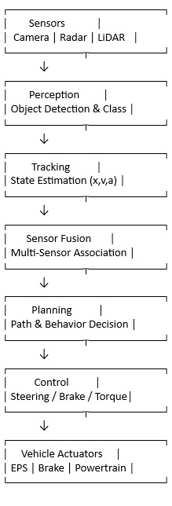

# ADAS System Architecture
This document describes a high-level architecture of an Advanced Driver Assistance System (ADAS).
The goal of the system is to perceive the vehicle’s surroundings, track relevant objects,
and support safe driving decisions such as maintaining distance or avoiding collisions.

## High-Level ADAS Architecture

### Architecture Description

**Sensors**: Camera, Radar, and LiDAR provide raw environmental data such as images,
  distance, and relative velocity of surrounding objects.
  
**Perception**: Raw sensor data is processed to detect lanes, vehicles, pedestrians,
  and other relevant objects in the environment.

**Tracking**: Tracking algorithms maintain object identity over time and estimate
  motion parameters such as velocity, reducing noise from frame-by-frame detections.

**Sensor Fusion**: Outputs from multiple sensors are combined to improve accuracy
  and robustness, especially under challenging conditions.

**Planning**: Based on the fused and tracked object information, the system decides
  appropriate vehicle behavior such as maintaining speed or slowing down.

**Control**: Planning decisions are converted into control commands for steering,
  braking, or acceleration.

**Actuation**: Control commands are executed by the vehicle’s physical systems.

### Note
Tracking is placed between Perception and Sensor Fusion to ensure temporal consistency
of detected objects before fusion and planning. Depending on system design, tracking
may also be integrated within the perception module.
